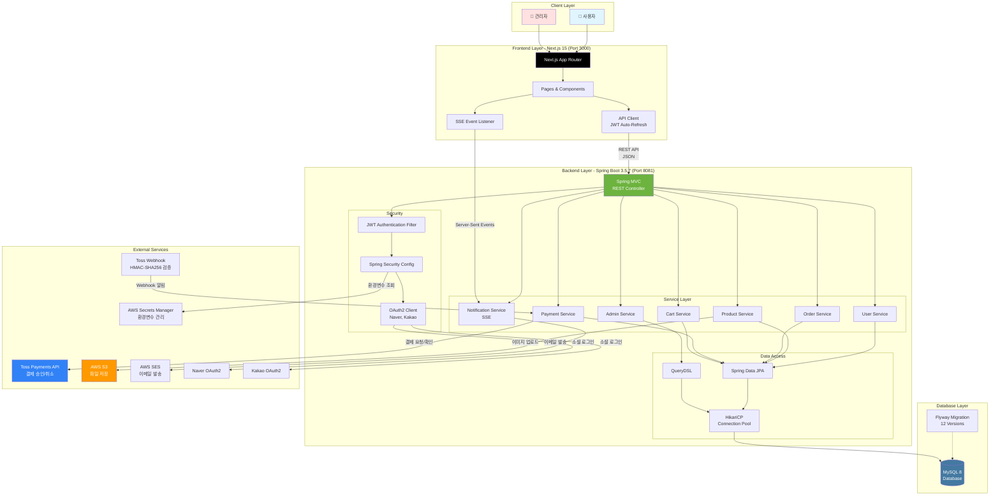
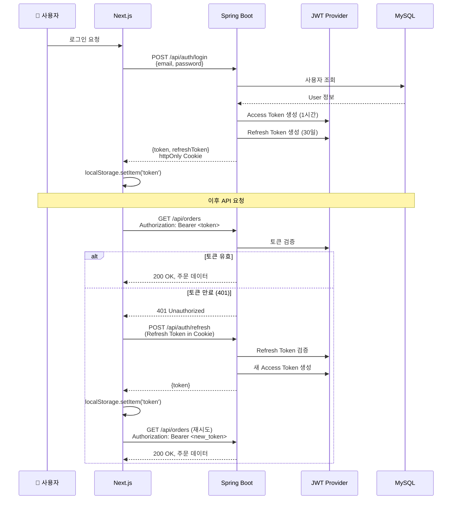
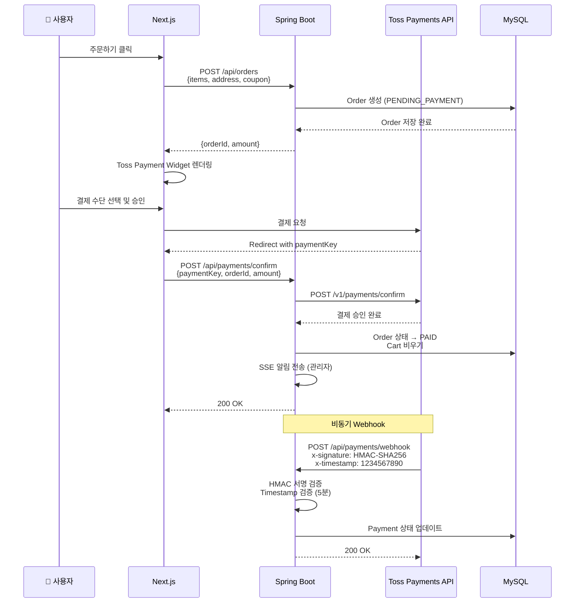
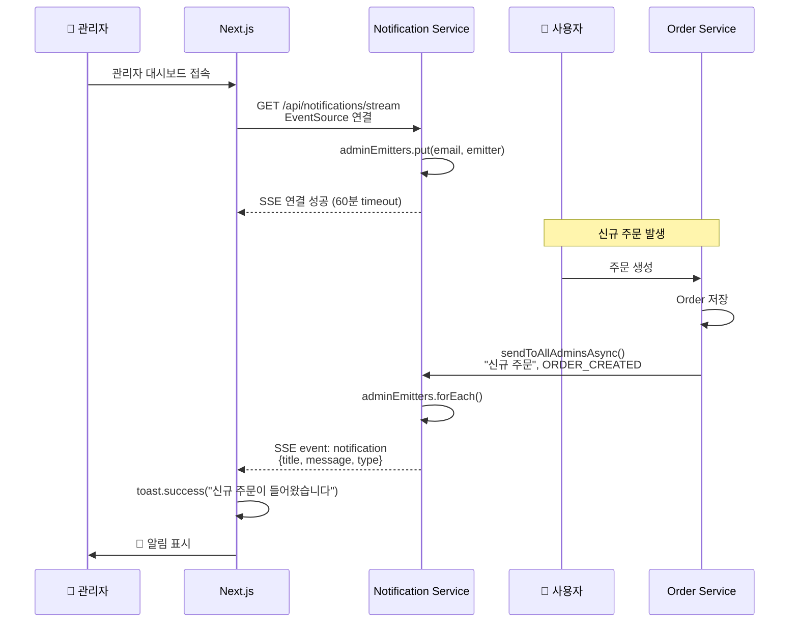

# Korean Agricultural Products E-commerce Platform - 시스템 아키텍처

## 1. Mermaid 다이어그램 (GitHub/Notion에서 렌더링 가능)

### 전체 시스템 아키텍처



### 인증 플로우



### 결제 플로우



### SSE 실시간 알림 플로우



---

## 2. ASCII 아트 다이어그램

```
┌─────────────────────────────────────────────────────────────────────────┐
│                             CLIENT LAYER                                 │
│                     👤 사용자          👤 관리자                          │
└─────────────────────────────────┬───────────────────────────────────────┘
                                  │
                                  │ HTTPS
                                  │
┌─────────────────────────────────▼───────────────────────────────────────┐
│                    FRONTEND - Next.js 15 (Port 3000)                     │
│  ┌─────────────────────────────────────────────────────────────────┐   │
│  │  Next.js App Router                                              │   │
│  │  ├─ app/                                                          │   │
│  │  │  ├─ page.tsx (홈)                                              │   │
│  │  │  ├─ product/[id]/ (상품 상세)                                  │   │
│  │  │  ├─ cart/ (장바구니)                                           │   │
│  │  │  ├─ checkout/ (주문)                                           │   │
│  │  │  ├─ payment/ (결제)                                            │   │
│  │  │  ├─ mypage/ (마이페이지)                                       │   │
│  │  │  └─ admin/ (관리자)                                            │   │
│  │  │                                                                 │   │
│  │  ├─ lib/api-client.ts (JWT Auto-Refresh)                         │   │
│  │  └─ hooks/useNotifications.ts (SSE Listener)                     │   │
│  └─────────────────────────────────────────────────────────────────┘   │
└─────────────────────────────────┬───────────────────────────────────────┘
                                  │
                                  │ REST API (JSON)
                                  │ SSE (Server-Sent Events)
                                  │
┌─────────────────────────────────▼───────────────────────────────────────┐
│              BACKEND - Spring Boot 3.5.7 (Port 8081)                    │
│                                                                           │
│  ┌────────────────────────────────────────────────────────────────┐    │
│  │                      SECURITY LAYER                             │    │
│  │  • JWT Authentication Filter                                    │    │
│  │  • Spring Security Config                                       │    │
│  │  • OAuth2 Client (Naver, Kakao)                                │    │
│  └────────────────────────────────────────────────────────────────┘    │
│                               ▼                                          │
│  ┌────────────────────────────────────────────────────────────────┐    │
│  │                     CONTROLLER LAYER                            │    │
│  │  • AuthController         • UserController                      │    │
│  │  • ProductController      • OrderController                     │    │
│  │  • PaymentController      • CartController                      │    │
│  │  • ReviewController       • AdminController                     │    │
│  │  • NotificationController (SSE)                                 │    │
│  └────────────────────────────────────────────────────────────────┘    │
│                               ▼                                          │
│  ┌────────────────────────────────────────────────────────────────┐    │
│  │                      SERVICE LAYER                              │    │
│  │  • UserService            • ProductService                      │    │
│  │  • OrderService           • PaymentService                      │    │
│  │  • CartService            • ReviewService                       │    │
│  │  • NotificationService    • AdminService                        │    │
│  │  • CouponService          • WishlistService                     │    │
│  └────────────────────────────────────────────────────────────────┘    │
│                               ▼                                          │
│  ┌────────────────────────────────────────────────────────────────┐    │
│  │                   DATA ACCESS LAYER                             │    │
│  │  • Spring Data JPA (Repository)                                 │    │
│  │  • QueryDSL (Complex Query)                                     │    │
│  │  • HikariCP Connection Pool (max 5, leak detection 10s)        │    │
│  └────────────────────────────────────────────────────────────────┘    │
│                                                                           │
└─────────────────────────────────┬───────────────────────────────────────┘
                                  │
                                  │ JDBC
                                  │
┌─────────────────────────────────▼───────────────────────────────────────┐
│                    DATABASE - MySQL 8                                    │
│                                                                           │
│  ┌─────────────────────────────────────────────────────────────────┐   │
│  │  Tables (20+ tables)                                             │   │
│  │  • users                  • products                             │   │
│  │  • product_options        • product_images                       │   │
│  │  • orders                 • order_items                          │   │
│  │  • payments               • carts, cart_items                    │   │
│  │  • reviews                • wishlists                            │   │
│  │  • coupons                • notifications                        │   │
│  │  • banners, categories, sellers, etc.                           │   │
│  └─────────────────────────────────────────────────────────────────┘   │
│                                                                           │
│  Flyway Migration (12 versions)                                          │
└───────────────────────────────────────────────────────────────────────────┘


┌─────────────────────────────────────────────────────────────────────────┐
│                          EXTERNAL SERVICES                               │
│                                                                           │
│  ┌──────────────────┐   ┌──────────────────┐   ┌──────────────────┐   │
│  │ Toss Payments    │   │  AWS S3          │   │  AWS SES         │   │
│  │ • 결제 승인/취소  │   │  • 파일 저장      │   │  • 이메일 발송    │   │
│  │ • Webhook 알림   │   │  • 상품 이미지    │   │                  │   │
│  │ • HMAC 검증      │   │                  │   │                  │   │
│  └──────────────────┘   └──────────────────┘   └──────────────────┘   │
│                                                                           │
│  ┌──────────────────┐   ┌──────────────────┐                           │
│  │ Naver OAuth2     │   │ Kakao OAuth2     │                           │
│  │ • 소셜 로그인     │   │ • 소셜 로그인     │                           │
│  └──────────────────┘   └──────────────────┘                           │
└───────────────────────────────────────────────────────────────────────────┘
```

---

## 3. 데이터 플로우

### 주문 생성부터 결제까지

```
1. 사용자 → Frontend (Next.js)
   ├─ 상품 선택
   ├─ 장바구니 담기 (POST /api/carts)
   └─ 주문하기 클릭

2. Frontend → Backend (Spring Boot)
   ├─ POST /api/orders
   │  ├─ Authorization: Bearer <JWT>
   │  └─ Body: {items: [{productOptionId, quantity}], address, coupon}
   │
   └─ Backend 처리
      ├─ JWT 검증 (JwtAuthenticationFilter)
      ├─ User 조회
      ├─ ProductOption 재고 확인
      ├─ Coupon 유효성 검증
      ├─ Order 생성 (상태: PENDING_PAYMENT)
      ├─ OrderItem 생성 (각 상품 옵션별)
      └─ 응답: {orderId, amount}

3. Frontend → Toss Payments
   ├─ Payment Widget 렌더링
   ├─ 사용자 결제 수단 선택
   └─ Toss 서버로 결제 요청

4. Toss → Frontend (Redirect)
   └─ ?paymentKey=xxx&orderId=xxx&amount=xxx

5. Frontend → Backend
   ├─ POST /api/payments/confirm
   │  └─ Body: {paymentKey, orderId, amount}
   │
   └─ Backend 처리
      ├─ Order 조회 및 금액 검증
      ├─ Toss API 호출 (결제 승인 확인)
      │  └─ POST https://api.tosspayments.com/v1/payments/confirm
      ├─ Order 상태 → PAID
      ├─ Payment 레코드 생성
      ├─ Cart 비우기
      ├─ SSE 알림 (관리자에게 "신규 주문")
      └─ 응답: 200 OK

6. Toss → Backend (Webhook, 비동기)
   ├─ POST /api/payments/webhook
   │  ├─ x-signature: HMAC-SHA256 서명
   │  └─ x-timestamp: 타임스탬프
   │
   └─ Backend 처리
      ├─ HMAC 서명 검증
      ├─ Timestamp 검증 (5분 이내)
      ├─ Payment 상태 업데이트
      └─ 응답: 200 OK
```

---

## 4. 기술 스택 계층별 정리

```
┌─────────────────────────────────────────────────────────────────┐
│                        PRESENTATION LAYER                        │
│  Next.js 15.2.4, React 19, TypeScript, Tailwind CSS             │
│  shadcn/ui (Radix UI), Recharts, React Hook Form + Zod         │
└─────────────────────────────────────────────────────────────────┘
                                ▼
┌─────────────────────────────────────────────────────────────────┐
│                        APPLICATION LAYER                         │
│  Spring Boot 3.5.7, Java 21                                     │
│  Spring Security, JWT (HS512), OAuth2                           │
│  Spring Data JPA, QueryDSL, HikariCP                            │
│  Resilience4j (Rate Limiting)                                   │
└─────────────────────────────────────────────────────────────────┘
                                ▼
┌─────────────────────────────────────────────────────────────────┐
│                        PERSISTENCE LAYER                         │
│  MySQL 8, Flyway Migration                                      │
│  20+ Tables, 12 Versions                                        │
└─────────────────────────────────────────────────────────────────┘
                                ▼
┌─────────────────────────────────────────────────────────────────┐
│                        INFRASTRUCTURE LAYER                      │
│  AWS S3 (파일 저장), AWS SES (이메일), AWS Secrets Manager      │
│  Toss Payments API (결제), Docker, Git                          │
└─────────────────────────────────────────────────────────────────┘
```

---

## 5. 보안 계층

```
┌──────────────────────────────────────────────────────────────────┐
│                        SECURITY LAYERS                            │
│                                                                   │
│  Layer 1: Transport Security                                      │
│  └─ HTTPS (TLS 1.2+)                                             │
│                                                                   │
│  Layer 2: Authentication                                          │
│  ├─ JWT (HS512, 512-bit secret)                                  │
│  │  ├─ Access Token: 1시간 (localStorage)                        │
│  │  └─ Refresh Token: 30일 (httpOnly Cookie)                     │
│  └─ OAuth2 (Naver, Kakao)                                        │
│                                                                   │
│  Layer 3: Authorization                                           │
│  ├─ Spring Security FilterChain                                  │
│  ├─ Role-based Access Control (USER, ADMIN)                      │
│  └─ Method-level @PreAuthorize                                   │
│                                                                   │
│  Layer 4: API Security                                            │
│  ├─ Rate Limiting (Resilience4j)                                 │
│  │  ├─ /api/auth: 5 req/min                                      │
│  │  ├─ /api/payment: 10 req/min                                  │
│  │  └─ /api/search: 100 req/min                                  │
│  └─ CORS (환경변수 기반 origins)                                  │
│                                                                   │
│  Layer 5: Payment Security                                        │
│  ├─ HMAC-SHA256 서명 검증 (Webhook)                              │
│  ├─ Timestamp 검증 (5분, Replay Attack 방지)                     │
│  └─ Constant-time 비교 (Timing Attack 방지)                      │
│                                                                   │
│  Layer 6: Database Security                                       │
│  ├─ Connection Pool 관리 (leak detection)                        │
│  ├─ Prepared Statement (SQL Injection 방지)                      │
│  └─ Password Hashing (BCrypt)                                    │
└───────────────────────────────────────────────────────────────────┘
```

---

## 6. 성능 최적화 전략

```
┌──────────────────────────────────────────────────────────────────┐
│                    PERFORMANCE OPTIMIZATION                       │
│                                                                   │
│  Frontend:                                                        │
│  ├─ Server Components (Next.js) - 초기 로딩 속도 향상             │
│  ├─ API Response Caching (SWR 패턴)                              │
│  ├─ Image Optimization (next/image)                              │
│  └─ Code Splitting (Dynamic Import)                              │
│                                                                   │
│  Backend:                                                         │
│  ├─ Connection Pool 최적화                                        │
│  │  ├─ HikariCP max-pool-size: 5                                │
│  │  ├─ leak-detection: 10s                                       │
│  │  └─ auto-commit: false                                        │
│  │                                                                │
│  ├─ Query 최적화                                                  │
│  │  ├─ QueryDSL fetch join (N+1 방지)                           │
│  │  ├─ DTO Projection (불필요한 필드 제외)                        │
│  │  ├─ Hibernate Batch Fetching (batch_size=10)                 │
│  │  └─ @Transactional(readOnly=true)                            │
│  │                                                                │
│  ├─ Lazy Loading 전략                                             │
│  │  └─ open-in-view=false (명시적 트랜잭션)                      │
│  │                                                                │
│  └─ 비동기 처리                                                   │
│     ├─ @Async (SSE 알림)                                         │
│     └─ @Scheduled (크롤러)                                       │
│                                                                   │
│  Database:                                                        │
│  ├─ Index 최적화 (V12 migration)                                 │
│  ├─ 복합 인덱스 (user_id + created_at)                            │
│  └─ 쿼리 실행 계획 분석 (EXPLAIN)                                 │
└───────────────────────────────────────────────────────────────────┘
```

---

_이 아키텍처 문서는 이력서 포트폴리오에 포함될 시스템 구조를 시각화한 것입니다._
