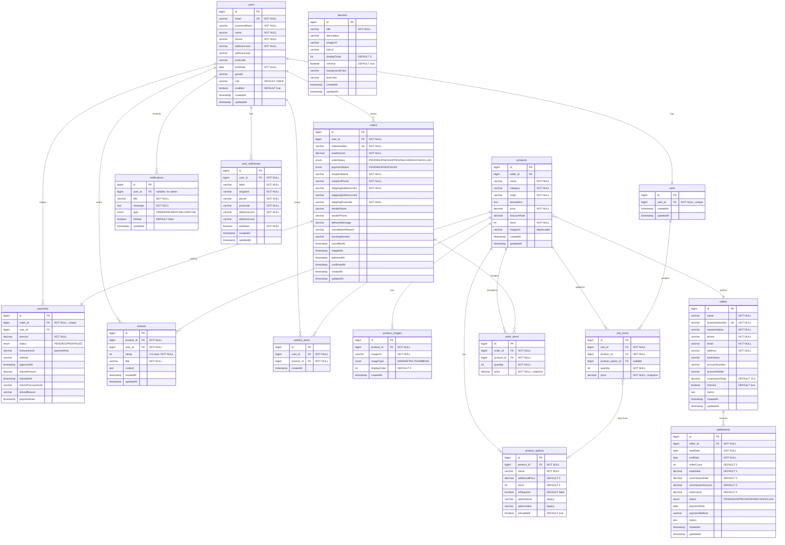

# Database ERD - Korean Agri Shop

이 다이어그램은 프로젝트의 데이터베이스 구조를 시각화한 것입니다.

## How to View

1. https://mermaid.js.org/에 방문
2. 아래의 Mermaid 코드를 복사해서 붙여넣기
3. 또는 GitHub에서 이 파일을 열면 자동으로 렌더링됩니다

## ERD Diagram

## Entity Descriptions

### Core Entities

- **users**: 회원 정보 (이메일 로그인, JWT 인증)
- **products**: 상품 정보 (농산물 상품)
- **product_options**: 상품 옵션 (크기, 무게 변형)
- **product_images**: 상품 이미지 (메인, 상세, 썸네일)

### Order & Payment

- **orders**: 주문 정보 (배송지, 주문 상태 관리)
- **order_items**: 주문 상품 목록 (가격 스냅샷)
- **payments**: 결제 정보 (Toss Payments 연동, 환불 정보)

### Shopping

- **carts**: 장바구니 (사용자당 1개)
- **cart_items**: 장바구니 상품 목록

### User Interaction

- **reviews**: 상품 리뷰 (별점 1-5)
- **wishlist_items**: 위시리스트 (찜 기능)
- **notifications**: 알림 (주문, 결제, 배송 알림)
- **user_addresses**: 배송지 관리

### Seller & Settlement

- **sellers**: 판매자/농가 정보
- **settlements**: 판매자 정산 관리

### Marketing

- **banners**: 배너 관리 (메인 페이지 배너)

## Key Relationships

1. **User ↔ Cart**: 1:1 관계, 사용자당 하나의 장바구니
2. **Product ↔ ProductOption**: 1:N, 상품은 여러 옵션 가질 수 있음
3. **Order ↔ Payment**: 1:1, 주문당 하나의 결제
4. **Product ↔ Seller**: N:1, 상품은 하나의 판매자에 속함
5. **Seller ↔ Settlement**: 1:N, 판매자는 여러 정산 기록 가능

## Notes

- **Price Snapshots**: `order_items`와 `cart_items`는 가격 스냅샷 저장 (가격 변동에도 주문 당시 가격 유지)
- **Soft Delete**: 대부분 엔티티는 물리 삭제, 필요시 isActive 플래그 사용
- **Timestamps**: 모든 엔티티는 `createdAt`, 주요 엔티티는 `updatedAt` 자동 관리
- **Enums**: OrderStatus, PaymentStatus, SettlementStatus, ImageType, NotificationType

## Tech Stack

- **ORM**: Spring Data JPA + Hibernate
- **Database**: MySQL 8.0
- **Connection Pool**: HikariCP
- **Auto DDL**: `hibernate.ddl-auto=update` (개발 환경)
